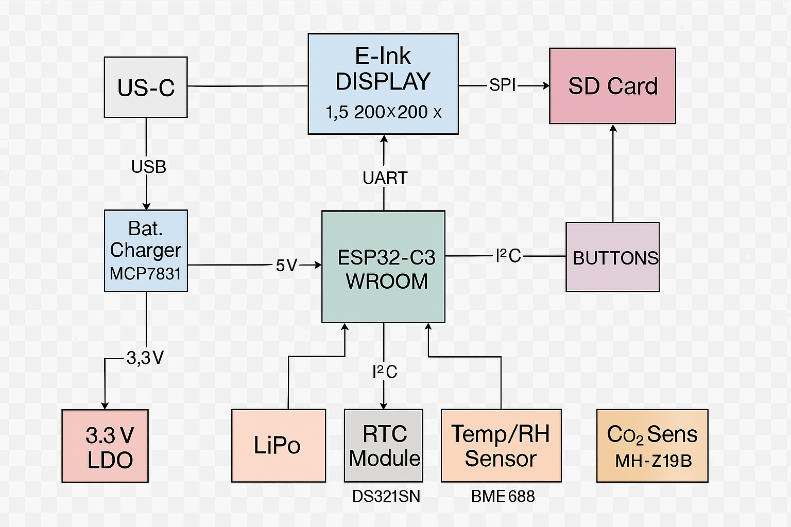

# README - OpenBook

**OpenBook** este un sistem portabil pentru citirea cărților electronice, proiectat în jurul microcontrollerului ESP32-C6-WROOM-1-N8. Dispozitivul integrează o serie de componente inteligente pentru stocare, afișare, alimentare și comunicații, toate optimizate pentru eficiență energetică și portabilitate.

## Diagrama bloc


---

## Componente Hardware & Funcționalitate
### Microcontroller Principal
- **ESP32-C6-WROOM-1-N8**

- Procesor RISC-V 32-bit

- Conectivitate Wi-Fi 6 și Bluetooth 5.0

- Memorie Flash internă de 8MB

- Nivel logic și alimentare: 3.3V

- Responsabil de comunicarea cu senzorii, ecranul EPD, memoria externă și stocarea datelor.

---

## Interfețe de Comunicație

| Interfață | Componente Conectate |
|----------|-----------------------|
| **I2C**  | BME688, MAX17048, DS3231SN |
| **SPI**  | Display E-Ink, SD Card, Flash Memory |
| **UART** | Serial debug via USB-C (TX/RX) |
| **GPIO** | Butoane, LED-uri, semnale control |

---

## Energie și Alimentare

- Alimentare prin **USB-C** sau baterie **Li-Po**
- Condensatori de decuplare de **100nF** aproape de fiecare pin de alimentare
- Regulator **LDO 3.3V** pentru circuitele logice
- Încărcarea bateriei este gestionată de **MCP73831**
- Plan de masă aplicat pe ambele straturi (**TOP & BOTTOM**) pentru stabilitate electrică

---

## Funcționalitate Detaliată

### ESP32-C6
- Rol: procesor central, interfațare completă cu toate modulele
- Conectat direct la:
  - UART: comunicare cu e-Paper
  - SPI: display, stocare date
  - I2C: senzori și RTC

### Display E-Ink
- Afișare text/imagine cu consum redus
- Interfață SPI dedicată

### Baterie & Protecții
- Baterie conectată la 4 pad-uri pentru economie de spațiu
- Decuplare prin condensatori de 100nF
- Protecții plasate strategic prin via stitching

---

## Structura Proiect
```
├── Hardware
│   ├── schematic_final.sch            # Fișier schematic
│   └── pcb final.brd            # Fișier PCB
├── Manufacturing
│   ├── gerbers.zip             # Fișiere Gerber generate
│   ├── bom.csv            # Bill of Materials
│   └── Pick and place.csv           # Pick and Place file
├── Mechanical
│   ├── exploded.step  # Model 3D exploded (PCB + baterie + ecran + carcasă)
│   └── OpenBook Enclosure.f3z  # Model nativ Fusion360
├── Images
│   ├── 3d.png
│   └── baterie.png
|   └── exploded view.png
|   └── no lid.png
|   └── openbook enclosure.png
|   └── screen view.png
|   └── screen.png
└── README.md
```

## Bill of Materials
| Componenta | Link | Datasheet |
|-----------|--------------|-----------|
| BUTTON | [Model](https://industry.panasonic.com/global/en/products/control/switch/light-touch/number/evqpuj02k) | [Datasheet](https://www.lcsc.com/datasheet/lcsc_datasheet_2201121800_PANASONIC-EVQPUJ02K_C2936858.pdf) |
| CAPACITOR | [Model](https://componentsearchengine.com/part-view/R0402%201%25%20100%20K%20(RC0402FR-07100KL)/YAGEO) | [Datasheet](//efaidnbmnnnibpcajpcglclefindmkaj/https://www.resistor.com/assets/pdf/0402tstd.pdf) |
| CPH3225A | [Model](https://www.snapeda.com/parts/CPH3225A/Seiko+Instruments/view-part/?ref=eda) | [Datasheet](https://octopart.com/datasheet/cph3225a-seiko-25340571) |
| EVQPUJ02K | [Model](https://industry.panasonic.com/global/en/products/control/switch/light-touch/number/evqpuj02k) | [Datasheet](https://www.lcsc.com/datasheet/lcsc_datasheet_2201121800_PANASONIC-EVQPUJ02K_C2936858.pdf) |
| KP-1608SURCK | [Model](https://www.snapeda.com/parts/KP-1608SURCK/Kingbright/view-part/?ref=search&t=LED%200603) | [Datasheet](//efaidnbmnnnibpcajpcglclefindmkaj/https://media.elv.com/file/107153_led_surck1608_data.pdf) |
| USBLC6-2SC6Y | [Model](https://www.snapeda.com/parts/USBLC6-2SC6Y/STMicroelectronics/view-part/?ref=eda) | [Datasheet](https://www.digikey.com/en/htmldatasheets/production/1375342/0/0/1/usblc6-2sc6y) |
| SD0805S020S1R0 | [Model](https://ro.mouser.com/ProductDetail/KYOCERA-AVX/SD0805S020S1R0?qs=jCA%252BPfw4LHbpkAoSnwrdjw%3D%3D) | [Datasheet](https://www.alldatasheet.com/view.jsp?Searchword=SD0805S&sField=2) |
| PGB1010603MR | [Model](https://www.snapeda.com/parts/PGB1010603MR/Littelfuse/view-part/?ref=eda) | [Datasheet](https://www.alldatasheet.com/view.jsp?Searchword=Pgb1010603mr&gad_source=1&gbraid=0AAAAADcdDU8aYfZtfJfdZ9I5j6RwZ_cbA&gclid=Cj0KCQjwqcO_BhDaARIsACz62vOPBOBe0eOh5gDUFkkKl4JBcbmoFZYtJ8BOnbaWqr_BuUCcVWvbutAaAmGkEALw_wcB) |
| BD5229G-TR  | [Model](https://componentsearchengine.com/part-view/BD5229G-TR/ROHM%20Semiconductor) | [Datasheet](https://www.lcsc.com/datasheet/lcsc_datasheet_2201131330_ROHM-Semicon-BD5229G-TR_C962636.pdf) |
| XC6220A331MR-G | [Model](https://componentsearchengine.com/part-view/XC6220A331MR-G/Torex) | [Datasheet](https://www.alldatasheet.com/view.jsp?Searchword=Xc6220&gad_source=1&gbraid=0AAAAADcdDU8aYfZtfJfdZ9I5j6RwZ_cbA&gclid=Cj0KCQjwqcO_BhDaARIsACz62vPS06NB6tLgniZzfaVpKNu1m811BNk6AEPfg4DbP6f5S8QWA_pW_UQaAv-0EALw_wcB) |
| XC6220A331MR-G | [Model](https://componentsearchengine.com/part-view/XC6220A331MR-G/Torex) | [Datasheet](https://www.alldatasheet.com/view.jsp?Searchword=Xc6220&gad_source=1&gbraid=0AAAAADcdDU8aYfZtfJfdZ9I5j6RwZ_cbA&gclid=Cj0KCQjwqcO_BhDaARIsACz62vMO5_aHsn35cIZBK6oCFuB_WOxz_zKu4yOHJ69-EnaUd5Jfas_Avm8aAuk5EALw_wcB) |
| USB4110-GF-A  | [Model](https://componentsearchengine.com/part-view/USB4110-GF-A/GCT%20(GLOBAL%20CONNECTOR%20TECHNOLOGY)) | [Datasheet](//efaidnbmnnnibpcajpcglclefindmkaj/https://gct.co/files/drawings/usb4110.pdf) |
| Adafruit | [Model](https://eu.mouser.com/ProductDetail/Adafruit/4208?qs=PzGy0jfpSMtbScLbr0L5dw%3D%3D) | [Datasheet](https://www.arrow.com/en/manufacturers/adafruit-industries/datasheets) |
| Bobina | [Model](https://store.comet.srl.ro/Catalogue/Product/43497/) | [Datasheet](https://www.scribd.com/document/814581278/Datasheet-Bobina) |
| PFMF | [Model](https://www.mouser.co.uk/ProductDetail/EPCOS-TDK/B72520T0350K062?qs=dEfas%2FXlABIszF52uu7vrg%3D%3D) | [Datasheet](https://ro.mouser.com/c/ds/circuit-protection/thermistors/resettable-fuses-pptc/?m=Schurter&series=PFMF) |
| DMG2305UX-7 | [Model](https://componentsearchengine.com/part-view/DMG2305UX-7/Diodes%20Incorporated) | [Datasheet](//efaidnbmnnnibpcajpcglclefindmkaj/https://www.mouser.com/datasheet/2/115/DMG2305UX-266242.pdf?srsltid=AfmBOop22k34YTJJra1xubiU6LPiN4M4JlcWbRoSNdxSGFak8uWgXPpK) |
| Si1308EDL-T1-GE3 | [Model](https://componentsearchengine.com/part-view/SI1308EDL-T1-GE3/Vishay) | [Datasheet](https://www.alldatasheet.com/view.jsp?Searchword=Si1308edl&gad_source=1&gbraid=0AAAAADcdDU-px713ONYSnQ2O-gcwqYcFq&gclid=Cj0KCQjwqcO_BhDaARIsACz62vN_Nz3MJOc6J_03gnVBm7aSqC8v9wyP0VD-iRKP-gFrYgdhLi99I14aAlVJEALw_wcB) |
| R0402 | [Model](https://componentsearchengine.com/part-view/R0402%201%25%20100%20K%20(RC0402FR-07100KL)/YAGEO) | [Datasheet](//efaidnbmnnnibpcajpcglclefindmkaj/https://www.resistor.com/assets/pdf/0402tstd.pdf) |
| BME680 | [Model](https://www.snapeda.com/parts/BME680/Bosch/view-part/?welcome=home) | [Datasheet](//efaidnbmnnnibpcajpcglclefindmkaj/https://www.bosch-sensortec.com/media/boschsensortec/downloads/datasheets/bst-bme680-ds001.pdf) |
| SMD Solder | [Model](https://grabcad.com/library/solder-jumpers-1) | [Datasheet]() |
| W25Q512JVEIQ | [Model](https://www.snapeda.com/parts/ESP32-C6-WROOM-1-N8/Espressif+Systems/view-part/?ref=eda) | [Datasheet](//efaidnbmnnnibpcajpcglclefindmkaj/https://www.mouser.com/datasheet/2/949/W25Q512JV_SPI_RevB_06252019_KMS-2487502.pdf?srsltid=AfmBOoquExqDVgxEELF9CzuOGxHos0CD1nQDROHD6Eebdm2foNzqozqU) |
| ESP32-C6-WROOM-1-N8 | [Model](https://www.snapeda.com/parts/ESP32-C6-WROOM-1-N8/Espressif+Systems/view-part/?ref=eda) | [Datasheet](//efaidnbmnnnibpcajpcglclefindmkaj/https://www.mouser.com/catalog/specsheets/Espressif_ESP32_C6_WROOM_1%20_Datasheet_V0.1_PRELIMINARY_en.pdf?srsltid=AfmBOooHQKNitqODRaaPjoZInfWKTacDER1t5uRK6sKqT13TrzvVo_B7) |
| DS3231SN# | [Model](https://www.snapeda.com/parts/DS3231SN%23/Analog+Devices/view-part/?ref=eda) | [Datasheet](https://www.alldatasheet.com/view.jsp?Searchword=Ds3231sn%20datasheet&gad_source=1&gbraid=0AAAAADcdDU-Gy9URfMxGmqiPg7ci5L3wR&gclid=Cj0KCQjwqcO_BhDaARIsACz62vMkK3ETSnW2w7mo0Fa-wgWJGn89AxWCyIND6k5X8MmoPl6hv6VWwT8aAiS-EALw_wcB) |
| MAX17048G+T10 | [Model](https://www.snapeda.com/parts/MAX17048G+T10/Analog+Devices/view-part/?ref=eda) | [Datasheet](https://www.alldatasheet.com/view.jsp?Searchword=Max17048&gad_source=1&gbraid=0AAAAADcdDU8aYfZtfJfdZ9I5j6RwZ_cbA&gclid=Cj0KCQjwqcO_BhDaARIsACz62vNa9xrVfzjCjADRwXD0RBbo4Nret3ywwteDGLJKZui8ZL8KdVlTE7caAvQxEALw_wcB) |
| MCP73831T-5ACI/OT | [Model](https://www.mouser.co.uk/ProductDetail/Microchip-Technology/MCP73831T-5ACI-OT?qs=hH%252BOa0VZEiAcgAcEkuamXg%3D%3D) | [Datasheet](//efaidnbmnnnibpcajpcglclefindmkaj/https://ww1.microchip.com/downloads/en/DeviceDoc/MCP73831-Family-Data-Sheet-DS20001984H.pdf) |

## Detaliere Pini Utilizați (ESP32-C6 / U2)

| Pin ESP32 | Funcție Principală                  | Componentă Conectată / Scop                  |
| :-------- | :---------------------------------- | :------------------------------------------- |
| IO3       | RESET                               | SW2, IC5                                     |
| IO5       | GPIO                                | J4 (EPD_DC)                                  |
| IO6       | SPI SCK                             | J4 (EPD_SCK), J3 (SD_CLK)                    |
| IO7       | SPI MOSI                            | J4 (EPD_DIN), J3 (SD_DI)                     |
| IO8       | BOOT                                | SW1 (Buton Boot)                             |
| IO10      | GPIO / SPI CS                       | J3 (SD_CS)                                   |
| IO11      | GPIO / SPI CS                       | J4 (EPD_CS)                                  |
| IO13      | USB D-                              | J2 (USB-C D-) via D2                         |
| IO14      | USB D+                              | J2 (USB-C D+) via D2                         |
| IO19      | I2C SDA                             | IC2 (RTC SDA), IC3 (BME SDA/SDO)             |
| IO20      | I2C SCL                             | IC2 (RTC SCL), IC3 (BME SCL/SCK)             |
| IO21      | GPIO                                | J4 (EPD_RST)                                 |
| IO26      | GPIO                                | J4 (EPD_BUSY)                                |
| IO27      | SPI MISO                            | J4 (EPD_DOUT), J3 (SD_DO)                    |
| EN        | Enable                              | Pull-up la 3.3V                              |
| VDD       | Power                               | 3.3V                                         |
| GND       | Ground                              | Ground                                       |
| IO12      | Neutilizat                          | -                                            |
| IO24      | Neutilizat                          | -                                            |
| IO25      | Neutilizat                          | -                                            |
